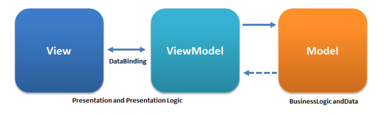

# MVVM Projects

11/14/2023 - upgraded to .NET 8.0

## MVVM Core

Dependencies:
- [CommunityToolkit.Mvvm](https://www.nuget.org/packages/CommunityToolkit.Mvvm)
- [Microsoft.Extensions.DependencyInjection](https://www.nuget.org/packages/Microsoft.Extensions.DependencyInjection)

There are multiple option for the data source:
- Json embedded files
- Sql database
- Api using Entity Framework

The data source is set in the `SericeProviderHelper` class by changing the `global using` statement.

The connection strings and endpoints are set in the MVVM.Wpf `appsettings.json` file.

## MVVM Wpf

Dependencies:
- [Common.Wpf.Controls](https://github.com/KevinDHeath/MyProjects/tree/main/src/Common/Wpf/Controls)
- [MVVM.Core](https://github.com/KevinDHeath/MyProjects/tree/main/src/MVVM/Core)

References:
- [WPF MVVM Navigation](https://www.youtube.com/playlist?list=PLA8ZIAm2I03ggP55JbLOrXl6puKw4rEb2) (YouTube)
