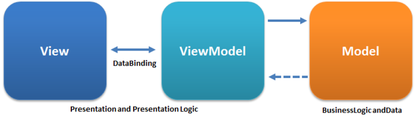

## MVVM Projects

### MVVM Core

Dependencies:
- [CommunityToolkit.Mvvm](https://www.nuget.org/packages/CommunityToolkit.Mvvm)
- [Microsoft.Extensions.DependencyInjection](https://www.nuget.org/packages/Microsoft.Extensions.DependencyInjection)

There are multiple option for the data source:
- Json embedded files
- Sql database
- Api using Entity Framework

The data source is set in the `SericeProviderHelper` class by changing the `global using` statement.

The connection strings and endpoints are set in the MVVM.Wpf `appsettings.json` file.

References:
- [Introduction to the MVVM Toolkit](https://learn.microsoft.com/en-us/dotnet/communitytoolkit/mvvm/)\
[Announcing .NET Community Toolkit 8.2](https://devblogs.microsoft.com/dotnet/announcing-the-dotnet-community-toolkit-820/)\
[Announcing .NET Community Toolkit 8.1](https://devblogs.microsoft.com/dotnet/announcing-the-dotnet-community-toolkit-810/)\
[Announcing .NET Community Toolkit 8.0](https://devblogs.microsoft.com/dotnet/announcing-the-dotnet-community-toolkit-800/)

### MVVM Wpf

Dependencies:
- [kdheath.Wpf.Controls](https://www.nuget.org/packages/kdheath.Wpf.Controls)
- [MVVM.Core](https://github.com/KevinDHeath/HomeBase/tree/main/src/MVVM/Core)

References:
- [WPF MVVM Navigation](https://www.youtube.com/playlist?list=PLA8ZIAm2I03ggP55JbLOrXl6puKw4rEb2) (YouTube)
